# 🚜 Farming Simulator 25 Trainer – Total Control for Modern Farmers

Farming has never been this flexible. The **Farming Simulator 25 Trainer** gives players full management over their farm economy, growth cycles, and vehicle systems — all through an intuitive and powerful control interface.

Built for **Windows 10/11**, this trainer lets you adjust everything from **instant money and XP** to **crop yield multipliers**, **fuel levels**, and **equipment maintenance** — turning routine tasks into streamlined efficiency.


---

## 🌾 Overview

The **Farming Simulator 25 Trainer** is more than a money mod — it’s a **complete gameplay optimizer**. It modifies in-game systems to enhance your experience while preserving authentic simulation depth.

With one keypress, you can **instantly refill fuel**, **accelerate crop growth**, or **repair machinery** — all without navigating menus or installing complex mods.

[!NOTE]

> This trainer runs externally, ensuring no permanent game file changes. Safe for offline and private gameplay.

### Key Advantages

* Instant funds and bank balance control 💰
* One-click crop growth and harvest ready toggle 🌾
* Infinite fuel and seed supply
* Adjustable time speed and weather lock
* Vehicle condition freeze (no repairs needed)
* Real-time XP and level adjustment

---

## 🧩 Core Features

| Feature                 | Description                                         |
| ----------------------- | --------------------------------------------------- |
| **Money Editor**        | Set or add custom currency instantly to your save.  |
| **Growth Multiplier**   | Accelerate or slow down crop stages with precision. |
| **Fuel & Maintenance**  | Keeps all vehicles operational without refueling.   |
| **Weather & Time Lock** | Freeze time for screenshots or skip to sunrise.     |
| **XP Modifier**         | Gain quick access to equipment upgrades and skills. |
| **Item Spawner**        | Instantly generate seeds, fertilizers, and tools.   |

---

## 💻 Compatibility

| Platform                           | Supported |
| ---------------------------------- | --------- |
| **Windows 10 / 11 (64-bit)**       | ✅         |
| **Steam / Epic / Giants Launcher** | ✅         |
| **Gamepads (Xbox, DualSense)**     | ✅         |
| **Offline Mode**                   | ✅         |

[!IMPORTANT]

> Always launch the trainer **after** starting Farming Simulator 25 to ensure proper memory sync.

---

## ⚡ Setup & Usage

1. **Download** the verified trainer package.

2. **Extract** to a new folder.

3. Run `FS25Trainer.exe` as Administrator.

4. Launch *Farming Simulator 25*.

5. Once in-game, use the following hotkeys:

   ```bash
   F1 – Add $1,000,000  
   F2 – Instant Crop Growth  
   F3 – Infinite Fuel  
   F4 – Freeze Vehicle Condition  
   F5 – Max XP / Skills  
   F6 – Toggle Weather Lock  
   F8 – Save Trainer Config  
   ```

6. You can also open the overlay (default: **INSERT**) for a visual dashboard of values.

[!WARNING]

> Do not use the trainer in online co-op sessions — it’s designed strictly for solo or sandbox play.

---

### 🧠 Trainer Flow Diagram

```mermaid
flowchart TD
A[Start Trainer] --> B[Detect Game Process]
B --> C[Read Player Save Data]
C --> D{Command Input?}
D -- Money --> E[Modify Currency Value]
D -- Crops --> F[Adjust Growth Stages]
D -- Fuel --> G[Refill Vehicle Tanks]
D -- Weather --> H[Freeze / Advance Time]
E --> I[Display Update ✅]
F --> I
G --> I
H --> I
```



---

## ⚙️ Advanced Configuration

All settings are saved in `trainer_config.json`:

```json
{
  "currency_increment": 1000000,
  "growth_speed": 4.0,
  "fuel_infinite": true,
  "weather_lock": false,
  "xp_multiplier": 5,
  "ui_overlay_opacity": 0.9
}
```

### Popular Presets

* **Realistic Mode:** Slower growth, limited funds, full immersion.
* **Efficiency Mode:** Faster yield and auto-maintenance.
* **Sandbox Mode:** Infinite resources for creative farming builds.

---

## ❓ FAQ

**Q: Does the trainer support the latest patch?**
Yes. It’s auto-updated for every *Farming Simulator 25* release via live offset sync.

**Q: Is it safe for my save files?**
Completely. The trainer never overwrites or deletes saves — it only adjusts memory values during runtime.

**Q: Can I edit crops individually?**
Yes. You can customize growth multipliers per crop (e.g., wheat 2x, canola 5x).

**Q: Does this work with mods?**
Absolutely. It’s compatible with most modded vehicles and maps.

**Q: How often is it updated?**
Weekly maintenance updates and version refresh after every FS25 patch.

---

## 🌻 Final Thoughts

The **Farming Simulator 25 Trainer** empowers you to play your way — whether that means maximizing profits, experimenting with custom growth rates, or simply focusing on design and machinery.

You’re not breaking the simulation — you’re **refining it**.
Turn your farm into a fully optimized ecosystem and enjoy freedom beyond the limits of vanilla gameplay.

---

*© 2025 Farming Simulator 25 Trainer. Designed for freedom, control, and next-level farming simulation.*
